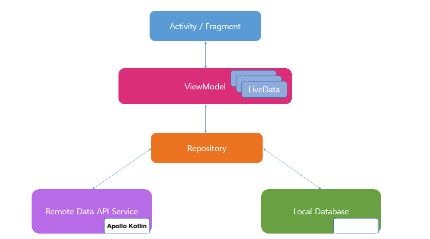

## About

This is a take home assignment project from Product hunt.  

## Setup

Import the project to Android Studio and wait until it resolved all the packages and dependecies. 

## Project Use Case

1. Home Screen: Showing list of posts by makers(hunter):
   1. Showing: Post thumbnail, tagline, name, vote count 

2. Post Detail Screen: Showing information on the post 
   1. Showing: Post thumbnail, tagline, name, description, maker username, vote count 

3. Profile Screen: Showing information about the maker (user)
   1. Showing: User thumbnail, name, tagline

### App Demo 

## Tech Stack & Open Source Libraries

- Minimum SDK level 21
- [Kotlin](https://kotlinlang.org/) based, [Coroutines](https://github.com/Kotlin/kotlinx.coroutines) for asynchronous.
- [Koin](https://github.com/InsertKoinIO/koin) for dependency injection. Koin - a pragmatic lightweight dependency injection framework for Kotlin
- Jetpack
  - [ViewModel](https://developer.android.com/topic/libraries/architecture/viewmodel) - UI related data holder, lifecycle aware.
  - [LiveData](https://developer.android.com/topic/libraries/architecture/livedata) - To view data and observe changes
  - [Navigation Components](https://developer.android.com/topic/libraries/architecture/navigation/). - To simplify navigation and data passing within the app using 
  - [View Binding](https://developer.android.com/topic/libraries/view-binding) - View binding elegently with compile-time satefy 
  - [ConstraintLayout](https://developer.android.com/reference/androidx/constraintlayout/widget/ConstraintLayout) - implementing transformation motion animations.
- Architecture
  - MVVM Architecture (View - ViewModel - Model)
  - Repository pattern
- [Apollo Kotlin](https://github.com/apollographql/apollo-kotlin) - Apollo Kotlin (formerly known as Apollo Android) is a GraphQL client that generates Kotlin and Java models from GraphQL queries.
- [OkHttp](https://square.github.io/okhttp/) - OkHttp is an HTTP client that’s efficient by default:
- [Glide](https://github.com/bumptech/glide) - loading images.
- [Postman](https://www.postman.com/) - An API platform to build and use APIs  

## Architecture 

## API

API provided: https://api.producthunt.com/v2/api/graphql

## Unfinished taks

* Not displaying the list of makers in the Post detail screen. Only showing the username of the first maker. I could do it with a horizontal list to show the list of makers
* Not showing list of tags in the post detail screen
* The list should load more as the user scrolls
* has infinite scroll list of post items the user has voted for
